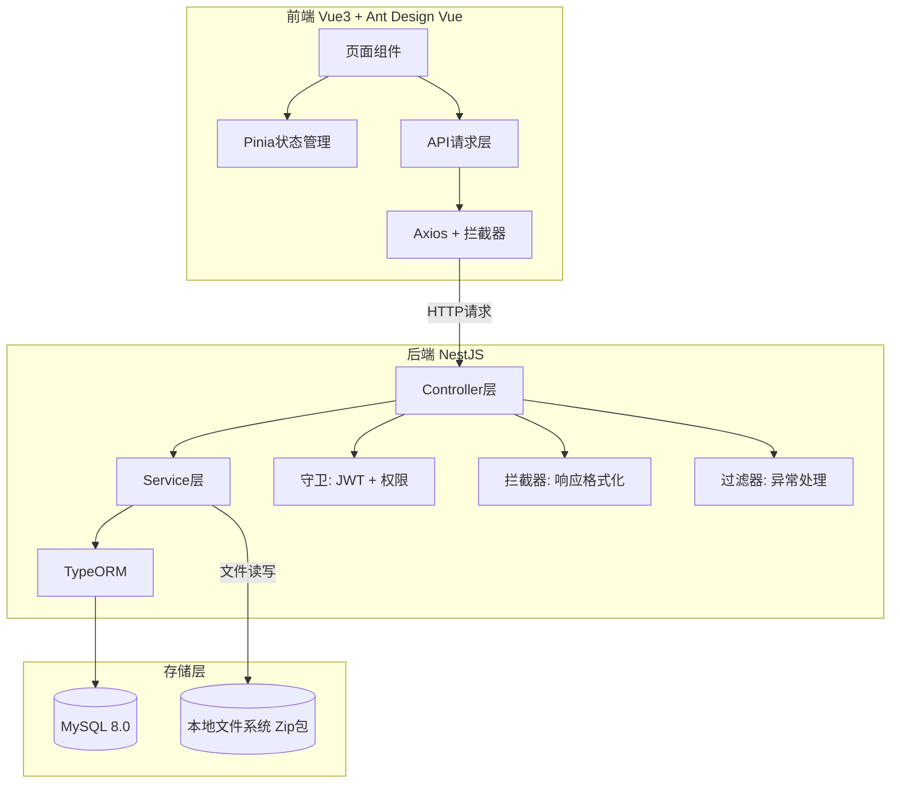

## 产品概述

云贝Skill管理系统——集中管理公司员工使用的AI skill、插件、提示词等资源，支持skill的提交、审核、入库、发布全流程管理，提供统一的skill检索和下载能力，支持评分反馈和项目关联追踪。

## 核心功能

- **Skill入库管理**：skill提交、Zip包上传、人工审核、入库发布、驳回处理、来源标识、关联项目、分类选择
- **Skill版本管理**：版本记录、更新提交、站内通知、历史版本查看和下载
- **Skill审核管理**：审核流程管理、审核员分配、审核意见填写、审核记录查询
- **Skill检索中心**：关键词搜索、分类筛选、来源筛选、详情查看、评分展示、Zip包下载、版本选择
- **Skill分类管理**：预设7个分类（AI智能、开发工具、效率提升、数据分析、内容创作、安全合规、通讯协作）
- **Skill评分反馈**：评分提交（1-5分）、使用反馈、评分限制、反馈管理
- **Skill下载记录管理**：历史下载skill列表、新版本提示、下载记录详情
- **项目管理**：项目CRUD、项目成员管理、skill关联
- **统计管理**：全局/分类/评分/下载/项目/用户/时间维度统计、数据导出
- **多来源整合**：内部自研/外部平台来源标识和网址
- **组织部门管理**：部门层级、员工账号管理、权限配置
- **系统管理**：权限配置（基础/审核/管理自由组合）、操作日志、登录日志、站内通知

## 技术栈

- **后端**：NestJS 11 + TypeORM + MySQL 8.0 + JWT(passport) + Swagger + class-validator + bcryptjs
- **前端**：Vue3 + Ant Design Vue 4 + Pinia + Vue Router 4 + Axios + Vite
- **文件存储**：本地文件系统（Zip包上传/下载，后续可迁移OSS）
- **数据库**：MySQL 8.0

## 实现方案

采用与project1一致的技术架构，从零搭建项目。后端NestJS模块化架构，每个业务模块包含 controller/service/entity/dto 四层；前端Vue3组合式API + Pinia状态管理 + Ant Design Vue组件库。数据库沿用init.sql已设计的18张表，并按需求文档v1.8补充字段。

### 关键技术决策

1. **权限体系**：三种权限（basic/review/admin）自由组合，通过守卫统一拦截，admin权限自动拥有全部权限
2. **Skill可见范围**：skills表存visibility_type字段，skill_visibility表存具体项目/账号关联，查询时动态过滤
3. **文件上传**：使用multer中间件处理Zip包上传，存储到本地uploads目录，数据库记录路径
4. **站内通知**：版本更新和审核分配时自动创建通知记录，前端轮询或页面切换时查询
5. **统计模块**：使用SQL聚合查询，不引入额外缓存层，按需查询

### 数据库字段调整（对照需求文档v1.8）

- skills表：description拆分为summary（简介）+ detail（详细说明），新增author、source_url、source_url_name字段
- skill_categories预设分类更新为：AI智能、开发工具、效率提升、数据分析、内容创作、安全合规、通讯协作
- ratings表：唯一约束改为按(user_id, skill_id, version_id)组合
- feedbacks表：新增is_invalid字段（管理员标记无效反馈）

## 实现要点

- 后端统一响应格式：`{ code: 0, message: 'success', data, timestamp }`
- 全局异常过滤器处理HttpException，返回统一格式
- JWT认证守卫 + 权限守卫双层拦截，@Public()跳过认证，@RequirePermission()控制权限
- 前端Axios请求拦截器自动附加Token，响应拦截器统一错误处理和401跳转
- 前端路由守卫基于localStorage中的用户权限信息控制页面访问
- Zip包上传限制50MB，multer配置fileFilter校验文件类型

## 架构设计



## 目录结构

```
D:\Project\yunbeiskill\pcodebuddy-glm5.1\
├── yunbei-skill-api/                          # 后端项目
│   ├── database/
│   │   └── init.sql                           # [NEW] 数据库初始化脚本（基于project1调整字段）
│   ├── src/
│   │   ├── main.ts                            # [NEW] 入口：全局管道、Swagger、CORS
│   │   ├── app.module.ts                      # [NEW] 根模块：TypeORM、各业务模块注册
│   │   ├── config/
│   │   │   ├── database.config.ts             # [NEW] 数据库配置
│   │   │   └── jwt.config.ts                  # [NEW] JWT配置
│   │   ├── common/
│   │   │   ├── decorators/
│   │   │   │   ├── public.decorator.ts        # [NEW] @Public() @RequirePermission() 装饰器
│   │   │   │   └── current-user.decorator.ts  # [NEW] @CurrentUser() 装饰器
│   │   │   ├── guards/
│   │   │   │   ├── jwt-auth.guard.ts          # [NEW] JWT认证守卫
│   │   │   │   └── permission.guard.ts        # [NEW] 权限守卫
│   │   │   ├── interceptors/
│   │   │   │   └── response.interceptor.ts    # [NEW] 统一响应格式拦截器
│   │   │   ├── filters/
│   │   │   │   └── http-exception.filter.ts   # [NEW] 全局异常过滤器
│   │   │   └── dto/
│   │   │       └── pagination.dto.ts          # [NEW] 分页查询基础DTO
│   │   └── modules/
│   │       ├── auth/                          # 认证模块
│   │       │   ├── auth.module.ts
│   │       │   ├── auth.controller.ts
│   │       │   ├── auth.service.ts
│   │       │   ├── jwt.strategy.ts
│   │       │   └── dto/login.dto.ts
│   │       ├── user/                          # 用户管理模块
│   │       │   ├── user.module.ts
│   │       │   ├── user.controller.ts
│   │       │   ├── user.service.ts
│   │       │   ├── entities/user.entity.ts
│   │       │   └── dto/
│   │       ├── department/                    # 部门管理模块
│   │       │   ├── department.module.ts
│   │       │   ├── department.controller.ts
│   │       │   ├── department.service.ts
│   │       │   ├── entities/department.entity.ts
│   │       │   └── dto/
│   │       ├── permission/                    # 权限管理模块
│   │       │   ├── permission.module.ts
│   │       │   ├── permission.controller.ts
│   │       │   ├── permission.service.ts
│   │       │   ├── entities/permission.entity.ts
│   │       │   ├── entities/user-permission.entity.ts
│   │       │   └── dto/
│   │       ├── skill-category/                # Skill分类模块
│   │       │   ├── skill-category.module.ts
│   │       │   ├── skill-category.controller.ts
│   │       │   ├── skill-category.service.ts
│   │       │   ├── entities/skill-category.entity.ts
│   │       │   └── dto/
│   │       ├── project/                       # 项目管理模块
│   │       │   ├── project.module.ts
│   │       │   ├── project.controller.ts
│   │       │   ├── project.service.ts
│   │       │   ├── entities/project.entity.ts
│   │       │   ├── entities/project-member.entity.ts
│   │       │   ├── entities/project-skill.entity.ts
│   │       │   └── dto/
│   │       ├── skill/                         # Skill核心模块（入库+检索+可见范围）
│   │       │   ├── skill.module.ts
│   │       │   ├── skill.controller.ts
│   │       │   ├── skill.service.ts
│   │       │   ├── entities/skill.entity.ts
│   │       │   ├── entities/skill-version.entity.ts
│   │       │   ├── entities/skill-visibility.entity.ts
│   │       │   └── dto/
│   │       ├── review/                        # 审核管理模块
│   │       │   ├── review.module.ts
│   │       │   ├── review.controller.ts
│   │       │   ├── review.service.ts
│   │       │   ├── entities/review.entity.ts
│   │       │   └── dto/
│   │       ├── rating/                        # 评分模块
│   │       │   ├── rating.module.ts
│   │       │   ├── rating.controller.ts
│   │       │   ├── rating.service.ts
│   │       │   ├── entities/rating.entity.ts
│   │       │   └── dto/
│   │       ├── feedback/                      # 反馈模块
│   │       │   ├── feedback.module.ts
│   │       │   ├── feedback.controller.ts
│   │       │   ├── feedback.service.ts
│   │       │   ├── entities/feedback.entity.ts
│   │       │   └── dto/
│   │       ├── download/                      # 下载记录模块
│   │       │   ├── download.module.ts
│   │       │   ├── download.controller.ts
│   │       │   ├── download.service.ts
│   │       │   ├── entities/download-record.entity.ts
│   │       │   └── dto/
│   │       ├── notification/                  # 站内通知模块
│   │       │   ├── notification.module.ts
│   │       │   ├── notification.controller.ts
│   │       │   ├── notification.service.ts
│   │       │   ├── entities/notification.entity.ts
│   │       │   └── dto/
│   │       ├── statistics/                    # 统计管理模块
│   │       │   ├── statistics.module.ts
│   │       │   ├── statistics.controller.ts
│   │       │   ├── statistics.service.ts
│   │       │   └── dto/
│   │       ├── operation-log/                 # 操作日志模块
│   │       │   ├── operation-log.module.ts
│   │       │   ├── operation-log.controller.ts
│   │       │   ├── operation-log.service.ts
│   │       │   ├── entities/operation-log.entity.ts
│   │       │   └── dto/
│   │       └── login-log/                     # 登录日志模块
│   │           ├── login-log.module.ts
│   │           ├── login-log.controller.ts
│   │           ├── login-log.service.ts
│   │           ├── entities/login-log.entity.ts
│   │           └── dto/
│   ├── uploads/                               # Zip包上传目录
│   ├── .env                                   # 环境变量
│   ├── package.json
│   ├── tsconfig.json
│   ├── tsconfig.build.json
│   ├── nest-cli.json
│   └── eslint.config.mjs
│
├── yunbei-skill-web/                          # 前端项目
│   ├── src/
│   │   ├── main.ts                            # 入口：Vue3 + Pinia + Router + Antd
│   │   ├── App.vue                            # 根组件
│   │   ├── style.css                          # 全局样式
│   │   ├── api/
│   │   │   ├── request.ts                     # Axios封装 + 拦截器
│   │   │   ├── auth.ts                        # 认证API
│   │   │   ├── user.ts                        # 用户API
│   │   │   ├── department.ts                  # 部门API
│   │   │   ├── permission.ts                  # 权限API
│   │   │   ├── project.ts                     # 项目API
│   │   │   ├── skill.ts                       # Skill API（入库+检索+详情）
│   │   │   ├── skill-category.ts              # 分类API
│   │   │   ├── review.ts                      # 审核API
│   │   │   ├── rating.ts                      # 评分API
│   │   │   ├── feedback.ts                    # 反馈API
│   │   │   ├── download.ts                    # 下载API
│   │   │   ├── notification.ts                # 通知API
│   │   │   ├── statistics.ts                  # 统计API
│   │   │   └── log.ts                         # 日志API
│   │   ├── stores/
│   │   │   ├── auth.ts                        # 认证状态
│   │   │   └── notification.ts                # 通知状态（未读数）
│   │   ├── types/
│   │   │   ├── user.ts                        # 用户相关类型
│   │   │   ├── skill.ts                       # Skill相关类型
│   │   │   ├── project.ts                     # 项目相关类型
│   │   │   └── common.ts                      # 通用类型（分页等）
│   │   ├── components/
│   │   │   ├── layout/
│   │   │   │   └── AppLayout.vue              # 主布局（侧边栏+顶栏+内容区）
│   │   │   └── common/
│   │   │       ├── PageHeader.vue             # 页面标题
│   │   │       └── UploadZip.vue              # Zip包上传组件
│   │   ├── pages/
│   │   │   ├── auth/
│   │   │   │   └── Login.vue                  # 登录页
│   │   │   ├── dashboard/
│   │   │   │   └── Index.vue                  # 首页仪表盘
│   │   │   ├── skill/
│   │   │   │   ├── SearchCenter.vue           # Skill检索中心（列表+搜索+筛选）
│   │   │   │   ├── Detail.vue                 # Skill详情页（含版本选择、评分、反馈）
│   │   │   │   ├── Submit.vue                 # Skill提交页（新建/编辑）
│   │   │   │   └── MySubmissions.vue          # 我的提交记录
│   │   │   ├── review/
│   │   │   │   ├── PendingList.vue            # 待审核列表
│   │   │   │   └── ReviewDetail.vue           # 审核详情页
│   │   │   ├── download/
│   │   │   │   └── MyDownloads.vue            # 我的下载记录
│   │   │   ├── notification/
│   │   │   │   └── NotificationList.vue       # 站内通知列表
│   │   │   └── admin/
│   │   │       ├── UserList.vue               # 用户管理
│   │   │       ├── DepartmentList.vue         # 部门管理
│   │   │       ├── PermissionConfig.vue       # 权限配置
│   │   │       ├── ProjectList.vue            # 项目管理
│   │   │       ├── ProjectMembers.vue         # 项目成员管理
│   │   │       ├── FeedbackManage.vue         # 反馈管理（标记无效）
│   │   │       ├── Statistics.vue             # 统计管理
│   │   │       ├── OperationLogs.vue          # 操作日志
│   │   │       └── LoginLogs.vue              # 登录日志
│   │   └── router/
│   │       └── index.ts                       # 路由配置+守卫
│   ├── public/
│   ├── index.html
│   ├── vite.config.ts
│   ├── tsconfig.json
│   ├── tsconfig.app.json
│   ├── tsconfig.node.json
│   └── package.json
```

## 设计风格

采用现代企业级管理系统风格，深色侧边栏 + 浅色内容区，整体简洁专业。以 Ant Design Vue Pro 为视觉基准，侧边栏使用深蓝灰底色配白色文字和高亮色选中态，内容区白底灰边，表格使用斑马纹增强可读性。

## 页面规划

### 1. 登录页

- **品牌区块**：左侧占60%深色背景，展示系统Logo、名称"云贝Skill管理系统"、简短描述
- **登录表单**：右侧居中卡片，账号/密码输入框、登录按钮、系统版本号

### 2. 主布局

- **顶栏**：白色底，左侧面包屑导航，右侧通知铃铛（未读数气泡）、用户头像+下拉菜单（个人信息/退出）
- **侧边栏**：深蓝灰底(#001529)，Logo区、菜单项（含图标），管理员/审核员/员工按权限显示不同菜单
- **内容区**：浅灰底(#f0f2f5)，卡片式内容容器

### 3. Skill检索中心

- **搜索筛选栏**：关键词搜索框 + 分类下拉 + 来源下拉，一行排列
- **Skill卡片列表**：每行一个卡片，展示名称、简介、作者、分类标签、来源标签、评分星标、下载量、最新版本号
- **分页**：底部分页器

### 4. Skill详情页

- **顶部信息区**：名称、简介、作者、分类、来源、可见范围、评分统计（星标+分数+人数）
- **Tab切换区**：详细说明 | 版本历史 | 评分反馈 | 关联项目
- **操作区**：版本选择下拉 + 下载Zip按钮

### 5. Skill提交页

- **表单区**：基本信息（名称/简介/详细说明/作者/分类/来源）、来源网址信息（条件显示）、关联项目（多选）、可见范围（单选+条件表单）、Zip包上传、版本更新说明
- **提交按钮区**：保存草稿/提交审核

### 6. 审核管理页

- **待审核列表**：表格展示skill名称、提交人、分类、提交时间、状态标签、操作（审核/分配）
- **审核详情**：skill完整信息展示 + 审核意见输入 + 通过/驳回按钮

### 7. 管理后台页面

- **统计页**：顶部4个数据概览卡片（skill总数/下载量/用户数/评分总数），下方图表区
- **用户/部门/权限/项目管理**：标准CRUD表格页面，弹窗表单新增编辑
- **日志页面**：操作日志/登录日志表格，支持时间范围筛选

## SubAgent

- **code-explorer**: 用于在开发过程中探索已创建的代码文件结构、查找模块间依赖关系、验证代码实现是否完整